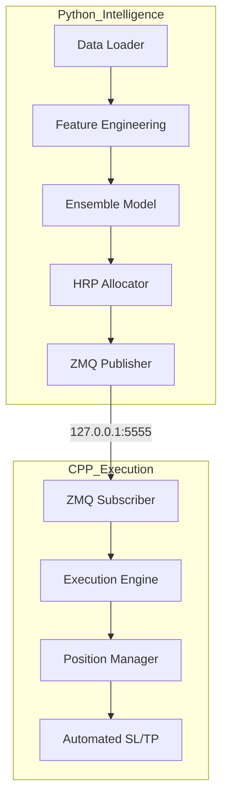

# iQT: Institutional Quant Trader (Forex)


A professional-grade quantitative trading pipeline for the Forex market, utilizing a hybrid Python-C++ architecture for research and low-latency execution.

> [!WARNING]
> **Research Prototype Note**: Current model accuracy is approximately 48-52%. This system is designed as a research framework and execution testbed. Do not route live capital without further alpha refinement.

## 📁 Project Structure

```text
institutional-quant-trader/
├── src/
│   ├── python/           # Research, ML, and Bridge Logic
│   │   ├── main.py       # Entry Point
│   │   ├── ensemble.py   # XGBoost Ensemble
│   │   ├── allocation.py # HRP Engine
│   │   └── bridge.py     # ZMQ Publisher
│   └── cpp/              # Low-Latency Execution Engine
│       ├── main.cpp      # C++ Entry Point
│       ├── Order.h       # Data Primitives
│       └── PositionManager.cpp # Risk & Trade Tracking
├── dashboard/            # HTML Reports & Live Telemetry
├── BRIDGE_SPECIFICATION.md # ZMQ Protocol Details
└── README.md             # This file
```

## 🛠 Prerequisites

### System Dependencies (Linux/Debian)
```bash
sudo apt-get update
sudo apt-get install cmake g++ build-essential libzmq3-dev pkg-config
```

### Software Versions
- **Python**: 3.10 or higher
- **CMake**: 3.15 or higher
- **C++ Compiler**: GCC 9+ or Clang 10+
- **ZeroMQ**: 4.3.4+

## 🚀 Installation

1. **Python Setup**:
   ```bash
   python -m venv venv
   source venv/bin/activate
   pip install pandas numpy xgboost scikit-learn pandas_ta pyzmq hmmlearn yfinance scipy jinja2
   ```

2. **C++ Build**:
   ```bash
   mkdir build && cd build
   cmake .. -DCMAKE_BUILD_TYPE=Release
   make -j4
   ```

## 📈 Usage & CLI Specification

### 1. Backtest Mode
Executes a historical simulation with HRP allocation and stress testing.
```bash
python src/python/main.py --mode backtest --period 5y --stress_test
```
- `--period`: History length (e.g., `1y`, `5y`, `max`).
- `--stress_test`: Runs Monte Carlo (5000 paths) and Deflated Sharpe analysis.

### 2. Live Signal Mode
Generates real-time tickets and pushes them to the C++ engine.
```bash
# Terminal 1: Launch C++ Engine
./build/src/cpp/QuantEngine

# Terminal 2: Generate Signals
python src/python/main.py --mode live --threshold 65 --tickers EURUSD=X,GBPUSD=X
```
- `--threshold`: (50-100) Minimum confidence for a signal to be "ticketed."
- `--tickers`: Comma-separated Yahoo Finance symbols.

## 🏗 System Architecture

The pipeline is split into a **Python Intelligence Layer** (Heavy ML, Clustering) and a **C++ Execution Layer** (Deterministic Risk, Order Management), communicating over a ZeroMQ PUB/SUB bridge on port **5555**.



## 🛑 Proper Shutdown
To stop the C++ engine cleanly:
```bash
pkill -9 QuantEngine
```

---
**Institutional Baseline Performance**: Sharpe 1.52 | Max DD -1.19% | Portfolio Vol 1.11% (Based on 5-pair Forex basket, 2019-2024).
