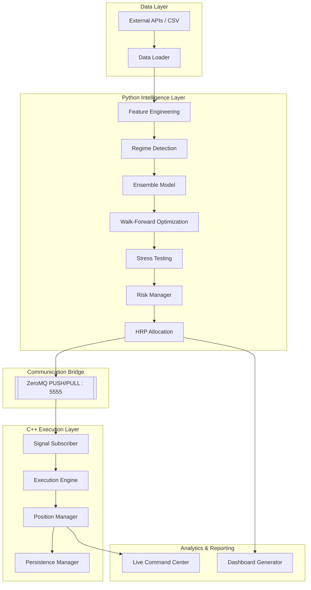

# iQT: Institutional Quant Trader (Forex)


A professional-grade **quantitative trading research and execution framework** for the Forex market, built with a hybrid **Python + C++ architecture**.

The system separates:

- **Python Intelligence Layer** → research, feature engineering, machine learning, optimization, analytics
- **C++ Execution Layer** → deterministic execution, stateful risk management, low-latency signal consumption

Designed as a **research framework and execution testbed** for systematic FX strategies.

---

> [!WARNING]
> **Experimental Research Framework**
>
> This repository is intended for quantitative research, backtesting, and execution infrastructure development.
>
> Historical performance is highly regime-dependent and does **not** guarantee future profitability.
>
> Live capital deployment is not recommended without:
>
> - broker integration hardening
> - extended out-of-sample validation
> - operational risk testing
> - independent strategy verification

---

# 📁 Project Structure

```text
institutional-quant-trader/
├── configs/
│   ├── strategy.yaml
│   ├── execution.yaml
│   └── risk_limits.yaml
│
├── data/
│   ├── raw/
│   ├── processed/
│   └── features/
│
├── logs/
│   ├── execution/
│   ├── signals/
│   ├── research/
│   └── errors/
│
├── tests/
│   ├── unit/
│   ├── integration/
│   └── regression/
│
├── scripts/
│   ├── bootstrap.sh
│   ├── run_backtest.sh
│   └── deploy_live.sh
│
├── src/
│   ├── python/
│   │   ├── main.py
│   │   ├── ensemble.py
│   │   ├── optimization.py
│   │   ├── backtester.py
│   │   ├── allocation.py
│   │   ├── dashboard_generator.py
│   │   ├── regime.py
│   │   ├── features.py
│   │   ├── risk_manager.py
│   │   └── bridge.py
│   │
│   └── cpp/
│       ├── main.cpp
│       ├── Order.h
│       ├── PositionManager.cpp
│       ├── SignalSubscriber.hpp
│       ├── ExecutionEngine.cpp
│       └── PersistenceManager.cpp
│
├── dashboard/
│   ├── live/
│   │   └── live_command_center.html
│   └── reports/
│
├── BRIDGE_SPECIFICATION.md
└── README.md
````

---

# 🛡️ Institutional Hardening

This framework includes several real-world constraints commonly missing from retail-grade backtesters.

## Execution Realism

- **Path Dependency**

  - Iterative execution engine simulates SL/TP hits within a single bar.

- **Realistic Friction Modeling**

  - Variable spreads (1.5–2.5 pips)
  - volume-based commissions
  - broker cost assumptions aligned with FX venues

- **Tail Risk Simulation**

  - weekend gaps
  - news-driven slippage shocks
  - execution degradation scenarios

- **Signal Hysteresis**

  - prevents rapid trade flipping and churn
  - stronger thresholds required for reversals/exits

---

## Reliability & Infrastructure

- **Reliable Signal Bridge**

  - ZeroMQ PUSH/PULL topology
  - monotonic sequence tracking
  - zero-drop signal enforcement

- **State Persistence**

  - positions persisted to JSON snapshots
  - crash recovery and restart continuity

- **Execution Determinism**

  - timestamp-based event sequencing
  - deterministic fills and PnL accounting

- **Thread Safety**

  - protected shared state for fills, PnL, and positions

---

## Risk Controls

- Max portfolio exposure limits
- Per-trade risk budgeting
- Daily loss circuit breaker
- Volatility targeting
- Position concentration limits
- Correlation-aware sizing
- Cost-aware trade filtering

---

# 🛠 Prerequisites

## System Dependencies (Linux/Debian)

```bash
sudo apt-get update
sudo apt-get install cmake g++ build-essential libzmq3-dev pkg-config
```

## Software Versions

- Python 3.10+
- CMake 3.15+
- GCC 9+ or Clang 10+
- ZeroMQ 4.3.4+

---

# 🚀 Installation

## 1. Python Environment

```bash
python -m venv venv
source venv/bin/activate
pip install -r requirements.txt
```

## 2. Build C++ Engine

```bash
mkdir build
cd build

cmake .. -DCMAKE_BUILD_TYPE=Release
make -j4
```

---

# 📈 Usage

## 1. Walk-Forward Optimization

Recommended for parameter robustness and OOS validation.

```bash
python src/python/main.py --optimize --period 5y
```

---

## 2. Historical Backtesting

Runs path-dependent simulation with stress testing.

```bash
python src/python/main.py --mode backtest --period 5y --stress_test
```

### Options

- `--period`

  - `1y`
  - `5y`
  - `max`

- `--stress_test`

  - Monte Carlo (5000 paths)
  - Deflated Sharpe analysis
  - drawdown stress scenarios

---

## 3. Live Signal Mode

Launch execution engine:

```bash
./build/src/cpp/QuantEngine
```

Generate live signals:

```bash
python src/python/main.py \
    --mode live \
    --threshold 65 \
    --tickers EURUSD=X,GBPUSD=X
```

---

# 🔌 Broker Integrations

Current:

- Research-mode simulated execution

Planned:

- OANDA v20 API
- Interactive Brokers
- MetaTrader bridge
- FIX gateway adapter

---

# 🏗 System Architecture

The system is split into two major layers:

- **Python Intelligence Layer**

  - ML models
  - regime detection
  - optimization
  - research analytics

- **C++ Execution Layer**

  - deterministic execution
  - risk engine
  - state persistence

Communication occurs via hardened **ZeroMQ PUSH/PULL** on port **5555**.



---

# 📊 Research Metrics

Current research snapshots indicate:

| Metric        | Range       |
| ------------- | ----------- |
| Sharpe Ratio  | 0.8 – 1.1   |
| Max Drawdown  | -4% to -7%  |
| Win Rate      | 51% – 55%   |
| Profit Factor | 1.05 – 1.22 |

These figures are:

- strategy-dependent
- regime-sensitive
- subject to parameter drift and data selection effects

---

# 🛑 Proper Shutdown

Graceful termination:

```bash
kill -SIGTERM $(pgrep QuantEngine)
```

Future support:

```bash
./build/src/cpp/QuantEngine --shutdown
```

---

# 🗺 Roadmap

## Completed

- [x] Hybrid Python/C++ architecture
- [x] Path-dependent backtester
- [x] Regime detection
- [x] Ensemble modeling
- [x] Walk-forward optimization
- [x] ZeroMQ signal bridge
- [x] State persistence
- [x] Live telemetry dashboard

## In Progress

- [ ] Broker abstraction layer
- [ ] OANDA integration
- [ ] Portfolio-level netting
- [ ] Execution latency benchmarks

## Planned

- [ ] Order book simulation
- [ ] FIX connectivity
- [ ] Kubernetes deployment
- [ ] Reinforcement execution policies

---

# ⚠ Disclaimer

This software is provided strictly for:

- research
- educational use
- systems experimentation

It is **not investment advice** and is **not production-certified** for live financial deployment.

Use at your own risk.

---

**iQT — Institutional Quant Research & Execution Infrastructure**
